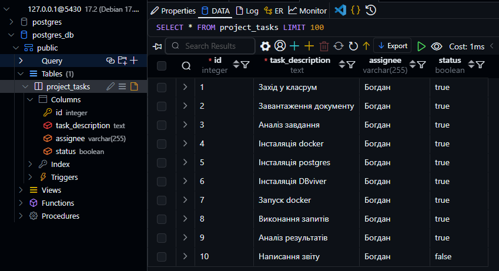

# КОМП’ЮТЕРНИЙ ПРАКТИКУМ No1

## СТВОРЕННЯ РОБОЧОГО СЕРЕДОВИЩА POSTGRESQL.
СТВОРЕННЯ ТА ЗАПОВНЕННЯ БАЗИ ДАНИХ

### Мета роботи: набуття навичок створення та налаштування робочого
середовища для бази даних PostgreSQL, вивчити особливості синтаксису
створення записів бази даних.

#### Варіант 9

Створити таблицю «Список задач для проекту» зі стовпцями:
Опис задачі, Відповідальний, Статус (виконано/не виконано).

### Хід роботи

``` sql
CREATE TABLE project_tasks (
    id SERIAL PRIMARY KEY,           -- Унікальний ідентифікатор для кожного завдання (автоінкремент)
    task_description TEXT NOT NULL,  -- Опис завдання (обов'язкове поле)
    assignee VARCHAR(255),           -- Ім'я або ID відповідального за виконання завдання
    status BOOLEAN DEFAULT FALSE     -- Статус виконання (FALSE - не виконано, TRUE - виконано)
);

```


```sql
INSERT INTO project_tasks (task_description, assignee, status) VALUES
('Захід у класрум', 'Богдан', TRUE),
('Завантаження документу', 'Богдан', TRUE),
('Аналіз завдання', 'Богдан', TRUE),
('Інсталяція docker', 'Богдан', TRUE),
('Інсталяція postgres', 'Богдан', TRUE),
('Інсталяція DBviewer', 'Богдан', TRUE),
('Запуск docker', 'Богдан', TRUE),
('Виконання запитів', 'Богдан', TRUE),
('Аналіз результатів', 'Богдан', TRUE),
('Написання звіту', 'Богдан', FALSE);
```



### Висновок

У процесі виконання лабораторної роботи було створено базу даних PostgreSQL, а також налаштовано робоче середовище для ефективного використання цієї бази. Створення таблиці "Список задач для проекту" і наповнення її даними продемонструвало основи синтаксису SQL, зокрема створення таблиць, визначення типів даних, використання обов'язкових і необов'язкових полів, а також вставку даних у таблицю за допомогою запиту INSERT INTO.

Запити були виконані успішно, що підтверджує коректність роботи з PostgreSQL та розуміння принципів побудови і маніпулювання базами даних. У результаті було сформовано список задач з відповідними статусами виконання, що дозволяє використовувати ці знання в подальших розробках баз даних для проектів.

У підсумку, робота з базою даних PostgreSQL є ефективним і гнучким інструментом для зберігання та обробки даних, що може бути використано в широкому спектрі застосувань, включаючи проекти в межах комп'ютерних практикумів, а також в реальних інженерних задачах.