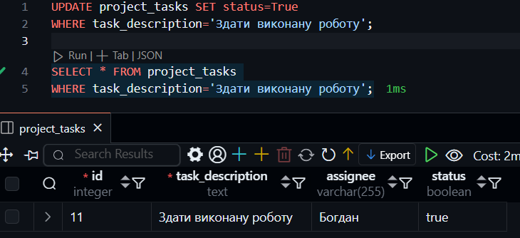

# КОМП’ЮТЕРНИЙ ПРАКТИКУМ No2

## ОСНОВНІ ОПЕРАЦІЇ. ВИВЧЕННЯ СИНТАКСИСУ КОМАНД

### Мета роботи: 
навчитися виконувати основні операції у системі керування базами даних
PostgreSQL та ознайомитися з синтаксисом команд.

#### Варіант 9


- Додати новий запис.
- Оновити існуючий запис.
- Видалити запис.

### Хід роботи.

```sql
INSERT INTO project_tasks (task_description, assignee, status)
VALUES ('Здати виконану роботу', 'Богдан', False);
```


```sql
UPDATE project_tasks SET status=True 
WHERE task_description='Здати виконану роботу';

SELECT * FROM project_task 
WHERE task_description='Здати виконану роботу';
```



```sql
DELETE FROM project_tasks 
WHERE task_description='Здати виконану роботу';

SELECT * FROM project_tasks 
WHERE task_description='Здати виконану роботу';
```


### Висновок

В ході виконання практичної роботи було здійснено основні операції з базою даних у PostgreSQL: додавання нового запису, оновлення існуючого та видалення запису. Команди були виконані успішно, що підтверджується скріншотами результатів запитів. У результаті роботи було закріплено навички роботи з основними SQL-операціями, що дозволяють ефективно маніпулювати даними у базі даних.