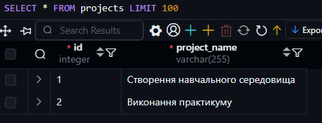
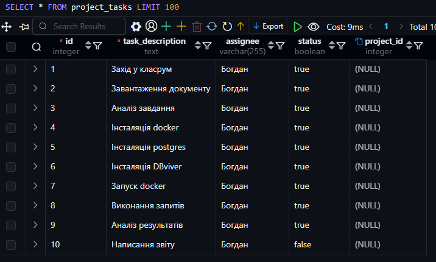
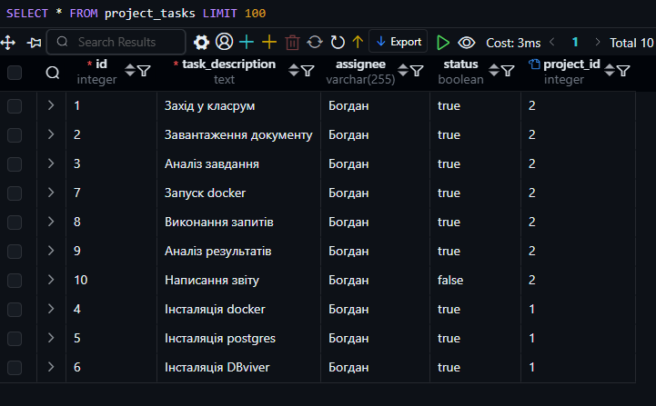
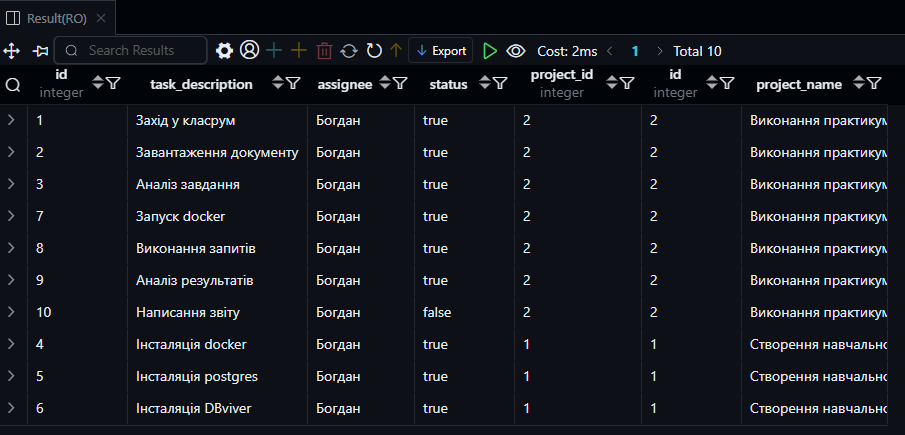

> TODO: Відсутня ERD. Умовою завдання є:
    "Зробити завдання з об’єднанням таблиць по варіанту та
    створити діаграму зв'язків"
# КОМП’ЮТЕРНИЙ ПРАКТИКУМ No3

## ПОЄДНАННЯ ТАБЛИЦЬ

### Мета роботи: 
набуття навичок створення запитів для поєднання
даних з кількох таблиць у базі даних PostgreSQL.


#### Варіант 9

Вибірка даних з кількох таблиць за допомогою INNER JOIN

### Хід роботи.

``` sql
CREATE TABLE projects (
    id SERIAL PRIMARY KEY,              -- Унікальний ідентифікатор проєкту
    project_name VARCHAR(255) NOT NULL  -- Назва проєкту
);
```

``` sql
INSERT INTO projects (project_name) VALUES
('Створення навчального середовища'),
('Виконання практикуму');
```



```sql
ALTER TABLE project_tasks ADD COLUMN project_id INT;

ALTER TABLE project_tasks ADD CONSTRAINT fk_project 
FOREIGN KEY (project_id) REFERENCES projects(id); 
```



```sql
UPDATE project_tasks SET project_id = 2;

UPDATE project_tasks SET project_id = 1 WHERE id IN (4,5,6);
```




```sql
SELECT * FROM project_tasks
INNER JOIN projects ON project_tasks.project_id = projects.id;
```



### **Висновок**  

У ході виконання лабораторної роботи було здобуто практичні навички роботи з реляційною базою даних PostgreSQL, зокрема створення таблиць, вставки даних та виконання запитів із використанням `INNER JOIN`.  

Було створено дві таблиці:  
- `project_tasks` – містить список завдань із відповідальними виконавцями та статусом виконання.  
- `projects` – містить інформацію про проєкти, до яких належать завдання.  

Для поєднання таблиць використовувалося поле `project_id`, яке зв’язує завдання з відповідним проєктом. Виконання запиту `INNER JOIN` дозволило отримати вибірку, яка відображає завдання разом із назвами їхніх проєктів.  

Таким чином, під час роботи було продемонстровано можливості реляційних баз даних щодо зв’язків між таблицями та об'єднання даних для отримання необхідної інформації. Ці навички є важливими при розробці складних інформаційних систем, що оперують взаємопов’язаними наборами даних.