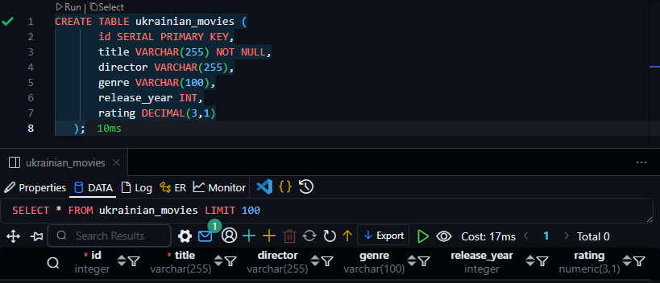
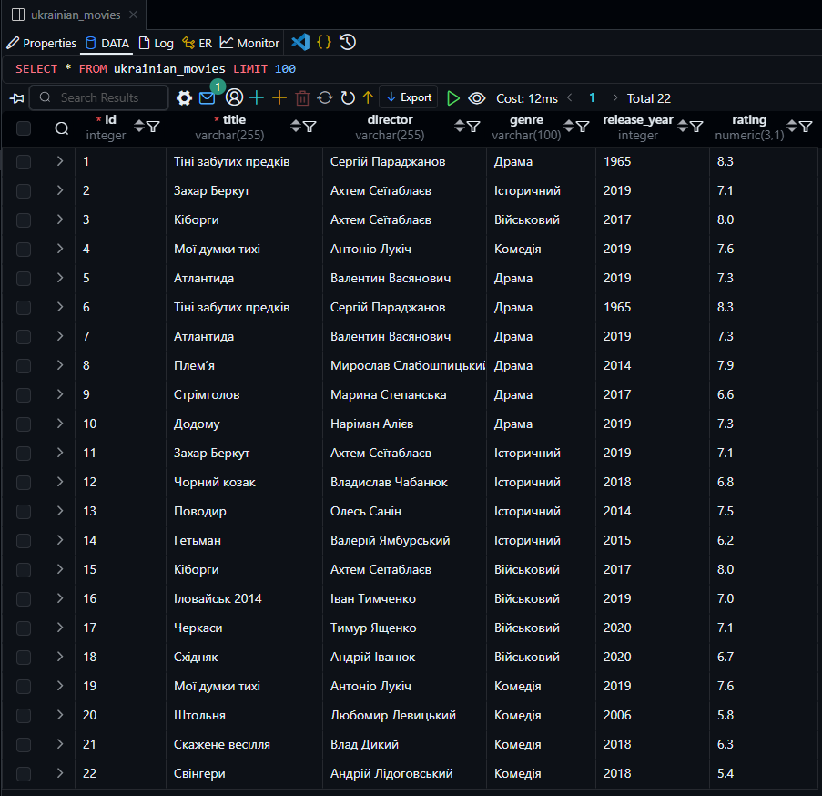
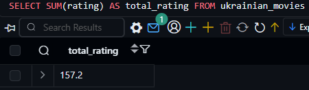
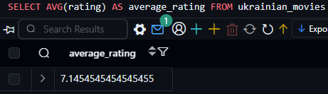
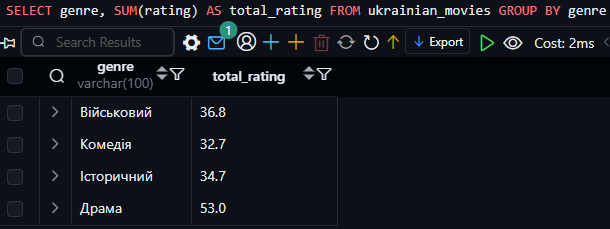
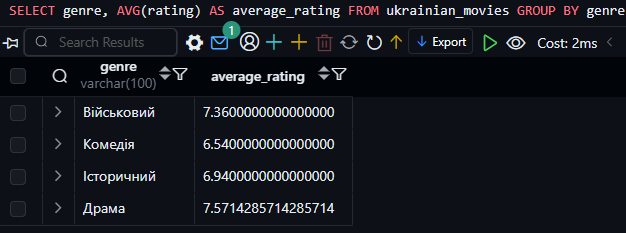

# КОМП’ЮТЕРНИЙ ПРАКТИКУМ No4

## АГРЕГАЦІЯ ТА ГРУПУВАННЯ

### Мета роботи:

Навчитися використовувати агрегатні функції `SUM()` та `AVG()` в SQL для обробки даних у базі даних PostgreSQL.

#### Варіант 9

### Хід роботи.

1. Створимо таблицю українських фільмів.  
   ```sql
   CREATE TABLE ukrainian_movies (
       id SERIAL PRIMARY KEY,
       title VARCHAR(255) NOT NULL,
       director VARCHAR(255),
       genre VARCHAR(100),
       release_year INT,
       rating DECIMAL(3,1)
   );
   ```
  
  

2. Заповнимо таблицю українських фільмів данними з інтернет ресурсу.
```sql
INSERT INTO ukrainian_movies (title, director, genre, release_year, rating) VALUES
  ('Тіні забутих предків', 'Сергій Параджанов', 'Драма', 1965, 8.3),
  ('Атлантида', 'Валентин Васянович', 'Драма', 2019, 7.3),
  ('Плем’я', 'Мирослав Слабошпицький', 'Драма', 2014, 7.9),
  ('Стрімголов', 'Марина Степанська', 'Драма', 2017, 6.6),
  ('Додому', 'Наріман Алієв', 'Драма', 2019, 7.3),
  ('Захар Беркут', 'Ахтем Сеїтаблаєв', 'Історичний', 2019, 7.1),
  ('Чорний козак', 'Владислав Чабанюк', 'Історичний', 2018, 6.8),
  ('Поводир', 'Олесь Санін', 'Історичний', 2014, 7.5),
  ('Гетьман', 'Валерій Ямбурський', 'Історичний', 2015, 6.2),
  ('Кіборги', 'Ахтем Сеїтаблаєв', 'Військовий', 2017, 8.0),
  ('Іловайськ 2014', 'Іван Тимченко', 'Військовий', 2019, 7.0),
  ('Черкаси', 'Тимур Ященко', 'Військовий', 2020, 7.1),
  ('Східняк', 'Андрій Іванюк', 'Військовий', 2020, 6.7),
  ('Мої думки тихі', 'Антоніо Лукіч', 'Комедія', 2019, 7.6),
  ('Штольня', 'Любомир Левицький', 'Комедія', 2006, 5.8),
  ('Скажене весілля', 'Влад Дикий', 'Комедія', 2018, 6.3),
  ('Свінгери', 'Андрій Лідоговський', 'Комедія', 2018, 5.4)
;
```


3. Використаємо агрегатні функції суми `SUM()` та середнього значення `AVG()`

   - Загальна сума рейтингів всіх фільмів:
     ```sql
     SELECT SUM(rating) AS total_rating FROM ukrainian_movies;
     ```
     
   - Середній рейтинг фільмів:
     ```sql
     SELECT AVG(rating) AS average_rating FROM ukrainian_movies;
     ```
     
   - Сума рейтингів по жанрах:
     ```sql
     SELECT genre, SUM(rating) AS total_rating FROM ukrainian_movies GROUP BY genre;
     ```
     
   - Середній рейтинг по жанрах:
     ```sql
     SELECT genre, AVG(rating) AS average_rating FROM ukrainian_movies GROUP BY genre;
     ```
     

### Висновок  

У ході виконання лабораторної роботи було здобуто практичні навички роботи з агрегатними функціями `SUM()` та `AVG()` у SQL. Було створено базу даних українських фільмів, виконано запити для підрахунку загальної суми та середнього рейтингу, а також проведено групування за жанрами. Отримані результати дозволяють ефективно аналізувати інформацію у базі даних.

