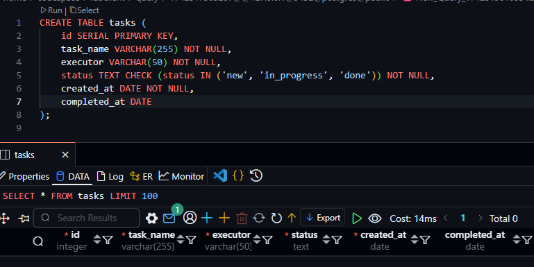
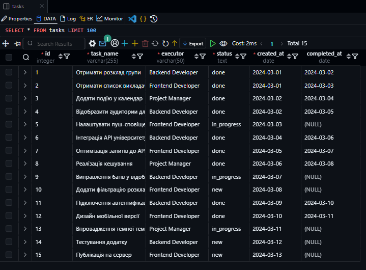
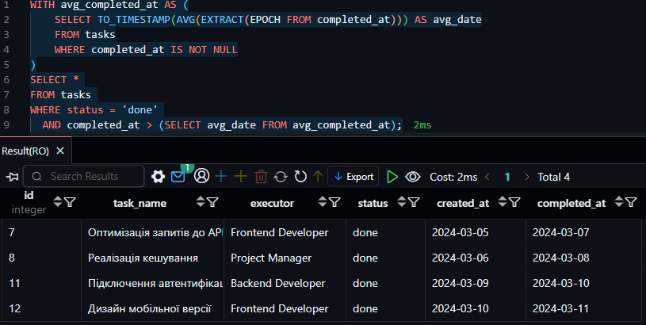
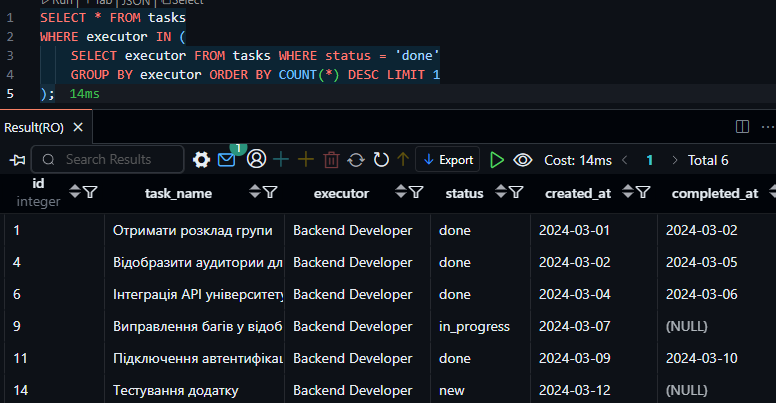
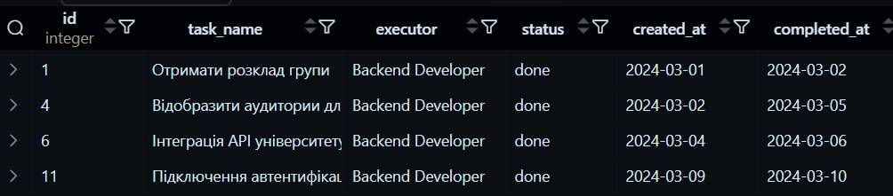

# КОМП’ЮТЕРНИЙ ПРАКТИКУМ No5

## СТВОРЕННЯ ПІДЗАПИТІВ

### Мета роботи: 
Навчитися створювати підзапити (субзапити) в SQL для
виконання складних запитів, що використовують результати одного запиту в
іншому.

#### Варіант 9
* Виберіть всі задачі, які виконано після середньої дати завершення
задач.
* Виберіть задачі, які були виконані відповідальними з найбільшим
числом виконаних задач.

### Хід роботи.
1. Створення таблиці tasks

```sql
CREATE TABLE tasks (
    id SERIAL PRIMARY KEY,
    task_name VARCHAR(255) NOT NULL,
    executor VARCHAR(50) NOT NULL,
    status TEXT CHECK (status IN ('new', 'in_progress', 'done')) NOT NULL,
    created_at DATE NOT NULL,
    completed_at DATE
);
```
> Нажаль в postgresql немає ENUM тому такий велосипед з полем status




2. Заповнення таблиці

```sql 
INSERT INTO tasks (task_name, executor, status, created_at, completed_at) VALUES
('Отримати розклад групи', 'Backend Developer', 'done', '2024-03-01', '2024-03-02'),
('Отримати список викладачів', 'Frontend Developer', 'done', '2024-03-01', '2024-03-03'),
('Додати подію у календар', 'Project Manager', 'done', '2024-03-02', '2024-03-04'),
('Відобразити аудитории для занять', 'Backend Developer', 'done', '2024-03-02', '2024-03-05'),
('Налаштувати пуш-сповіщення', 'Frontend Developer', 'in_progress', '2024-03-03', NULL),
('Інтеграція API університету', 'Backend Developer', 'done', '2024-03-04', '2024-03-06'),
('Оптимізація запитів до API', 'Frontend Developer', 'done', '2024-03-05', '2024-03-07'),
('Реалізація кешування', 'Project Manager', 'done', '2024-03-06', '2024-03-08'),
('Виправлення багів у відображенні розкладу', 'Backend Developer', 'in_progress', '2024-03-07', NULL),
('Додати фільтрацію розкладу', 'Frontend Developer', 'new', '2024-03-08', NULL),
('Підключення автентифікації', 'Backend Developer', 'done', '2024-03-09', '2024-03-10'),
('Дизайн мобільної версії', 'Frontend Developer', 'done', '2024-03-10', '2024-03-11'),
('Впровадження темної теми', 'Project Manager', 'in_progress', '2024-03-11', NULL),
('Тестування додатку', 'Backend Developer', 'new', '2024-03-12', NULL),
('Публікація на сервер', 'Frontend Developer', 'new', '2024-03-13', NULL);
```


3. Підзапит 1: Вибір всіх задач, які виконано після середньої дати завершення задач

```sql
WITH avg_completed_at AS (
    SELECT TO_TIMESTAMP(AVG(EXTRACT(EPOCH FROM completed_at))) AS avg_date
    FROM tasks
    WHERE completed_at IS NOT NULL
)
SELECT * 
FROM tasks 
WHERE status = 'done' 
  AND completed_at > (SELECT avg_date FROM avg_completed_at);
```



> Велосипед номер 2
Використав CTE (Common Table Expression) для обчислення середнього значення дати завершення задач. Оскільки середнє значення не можна обчислити безпосередньо для типу timestamp, я перевів його у формат секунд (Epoch) за допомогою функції EXTRACT(EPOCH FROM completed_at). Потім я обчислив середнє значення і перевів його назад в тип timestamp за допомогою функції TO_TIMESTAMP(). Зрештою, я вибрав усі задачі зі статусом 'done', де дата завершення була пізніше за обчислену середню."
4. Підзапит 2: Вибір задач, які були виконані відповідальними з найбільшою кількістю виконаних задач

```sql
WITH top_executors AS (
    SELECT executor
    FROM tasks
    WHERE status = 'done'
    GROUP BY executor
    HAVING COUNT(*) = (
        SELECT MAX(task_count)
        FROM (
            SELECT COUNT(*) AS task_count
            FROM tasks
            WHERE status = 'done'
            GROUP BY executor
        ) subquery
    )
)
SELECT *
FROM tasks
WHERE status = 'done'
  AND executor IN (SELECT executor FROM top_executors);
```

> У цьому запиті використовується CTE (Common Table Expression) для визначення виконавців, які виконали найбільшу кількість завдань зі статусом 'done'. Спочатку обчислюється максимальна кількість виконаних завдань, а потім вибираються всі виконавці, які досягли цього значення. У фінальному запиті виводяться всі завдання зі статусом 'done', виконані цими виконавцями.

<!--  -->


> Не до кінця зрозумів, що мається на увазі в завданні

### Висновок

У ході виконання лабораторної роботи було здобуто практичні навички роботи з підзапитами в SQL. Було створено таблицю задач, наповнено її даними, а також реалізовано запити для вибірки задач відповідно до умов варіанту 9. Виконані запити дозволили отримати список задач, завершених після середньої дати завершення, а також задачі, виконані відповідальними з найбільшою кількістю завершених завдань.

